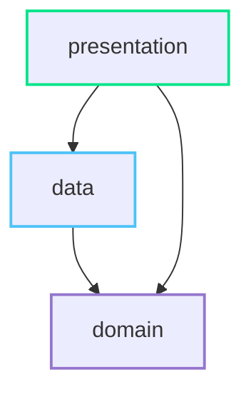

<a href="https://play.google.com/store/apps/details?id=com.lucky_lotto.mvi_test"></a> <a>&nbsp;&nbsp;</a>

<br>

# 행운 로또 추첨
> 💡 **키워드 로또 추첨과 통계 로또 추첨을 제공하는 행운 로또 추첨기**

### Feature
#### 키워드 추첨
- 사용자가 입력한 키워드를 유니코드 값으로 변경한 후, 랜덤 시드값에 포함시켜 추첨 진행
#### 통계 추첨
- 선택한 범위에 해당하는 회차 정보 통계 데이터를 제공하고 숫자 고정을 통해 추첨 진행
#### 추첨 기록 저장
- 각 추첨의 결과를 복사, 공유, 저장 기능 제공
#### QR 스캔
- 로또 추첨지의 QR 이미지를 인식하여 웹 추첨 결과 연결


### ScreenShots
|  |  |  |
|:--:|:--:|:--:|
|  |  |  |

<br>

# Module


<br>

# Architecture
**행운 로또 추첨**은 [Android Architecture Guide](https://developer.android.com/topic/architecture) 를 준수합니다.

### Overview

- Data, Domain, UI 총 세 개의 Layer로 구성되어 있습니다.
- [Unidirectional Data Flow](https://developer.android.com/topic/architecture/ui-layer#udf) 를 준수합니다.

    - 상위 Layer는 하위 Layer의 변화에 반응합니다. 
    - Event는 상위에서 하위 Layer로 이동합니다. 
    - Data는 하위에서 상위 Layer로 이동합니다.


- 데이터 흐름은 streams 통해 표현하며 Kotlin Flow를 사용합니다.


<br>

# Development
### Required
| Name | Version |
| --- | --- |
| IDE |   *```Android Studio Ladybug```* | 
| Kotlin |   *```2.0.0```* | 
| MinSdk  |   *```24```* | 
| TargetSdk  |   *```35```* | 


### Libraries
| Name | Version |
| --- | --- |
| Coroutines | *```1.6.4```* |
| Dagger-Hilt | *```2.51.1```* |
| Room | *```2.7.0```* |
| DataStore  | *```1.1.7```* |
| Timber | *```5.0.1```* |


> [!NOTE]
> 사용한 라이브러리 세부정보는 [libs.versions.toml](https://github.com/2blue-99/Lotto_compose/blob/master/gradle/libs.versions.toml) 를 참고해 주세요.
